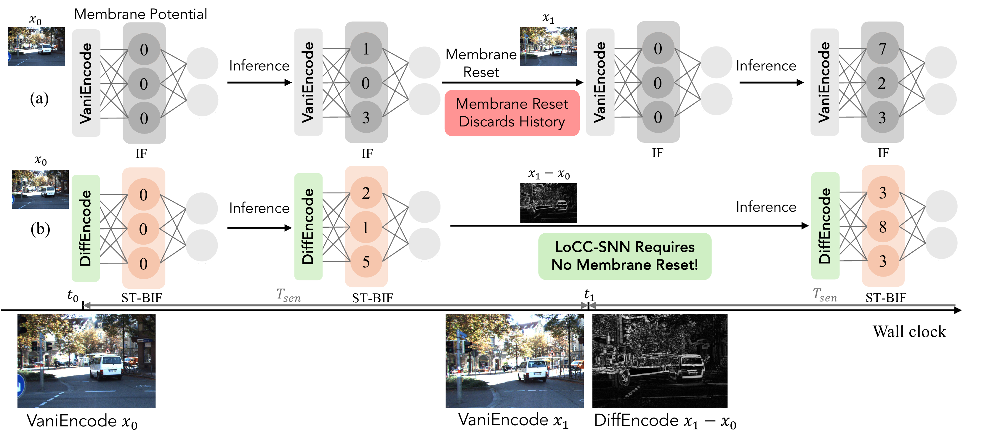

# ViStream: Improving Computation Efficiency of Visual Streaming Perception via Law-of-Charge-Conservation Inspired Spiking Neural Network

[](https://openaccess.thecvf.com/content/CVPR2025/papers/You_VISTREAM_Improving_Computation_Efficiency_of_Visual_Streaming_Perception_via_Law-of-Charge-Conservation_CVPR_2025_paper.pdf)
[](https://www.python.org/downloads/)
[](https://opensource.org/license/mulanpsl-2-0)

**Official PyTorch implementation of ViStream (CVPR  2025)**

> **[ViStream: Improving Computation Efficiency of Visual Streaming Perception via Law-of-Charge-Conservation Inspired Spiking Neural Network](https://openaccess.thecvf.com/content/CVPR2025/papers/You_VISTREAM_Improving_Computation_Efficiency_of_Visual_Streaming_Perception_via_Law-of-Charge-Conservation_CVPR_2025_paper.pdf)**  
> Kang You, Ziling Wei, Jing Yan, Boning Zhang, Qinghai Guo, Yaoyu Zhang, Zhezhi He  
> *Proceedings of the Computer Vision and Pattern Recognition Conference (CVPR), 2025*

## Abstract

Visual streaming perception (VSP) involves online intelligent processing of sequential frames captured by vision sensors, enabling real-time decision-making in applications such as autonomous driving, UAVs, and AR/VR. However, the computational efficiency of VSP on edge devices remains a challenge due to power constraints and the underutilization of temporal dependencies between frames. While spiking neural networks (SNNs) offer biologically inspired event-driven processing with potential energy benefits, their practical advantage over artificial neural networks (ANNs) for VSP tasks remains unproven.

In this work, we introduce a novel framework, **ViStream**, which leverages the Law of Charge Conservation (LoCC) property in ST-BIF neurons and a differential encoding (DiffEncode) scheme to optimize SNN inference for VSP. By encoding temporal differences between neighboring frames and eliminating frequent membrane resets, ViStream achieves significant computational reduction while maintaining accuracy equivalent to its ANN counterpart. We provide theoretical proofs of equivalence and validate ViStream across diverse VSP tasks, including object detection, tracking, and segmentation, demonstrating substantial energy savings without compromising performance.

<div align="center">
  
</div>

Demo videos showcasing ViStream's tracking performance on various scenarios are available in the [`demo_videos/`](demo_videos/) directory.

The core ViStream implementation can be found in [`model/spike_quan_layer.py`](model/spike_quan_layer.py) and [`model/spike_quan_wrapper.py`](model/spike_quan_wrapper.py).

## Model Checkpoint

The model checkpoint file is hosted on Hugging Face due to its large size (292MB). 

### Download Instructions

You can download the checkpoint file using one of the following methods:

#### Method 1: Using wget/curl
```bash
# Download the checkpoint file
wget https://huggingface.co/AndyBlocker/ViStream/resolve/main/checkpoint-90.pth
```

#### Method 2: Using Hugging Face Hub
```bash
# Install huggingface_hub if not already installed
pip install huggingface_hub

# Download using Python
python -c "from huggingface_hub import hf_hub_download; hf_hub_download(repo_id='AndyBlocker/ViStream', filename='checkpoint-90.pth', local_dir='.')"
```

#### Method 3: Using Git LFS (after cloning the HF repo)
```bash
# Clone the Hugging Face repository
git clone https://huggingface.co/AndyBlocker/ViStream
# Copy the checkpoint to your project directory
cp ViStream/checkpoint-90.pth ./
```

After downloading, make sure the checkpoint file is placed in the root directory of this project.

## Running Experiments

To run inference experiments, use the `eval.sh` script. The script contains various test commands for different tracking tasks:

- **VOS (Video Object Segmentation)**: Uncomment the `test_vos.py` lines  
- **MOT (Multiple Object Tracking)**: Uncomment the `test_mot.py` lines
- **MOTS (Multiple Object Tracking and Segmentation)**: Uncomment the `test_mots.py` lines
- **Pose Tracking**: Uncomment the `test_posetrack.py` lines

**Usage:** Uncomment the desired experiment lines in `eval.sh`, then run:
```bash
bash eval.sh
```

## Citation

If you find this work useful for your research, please cite:

```bibtex
@inproceedings{you2025vistream,
  title={VISTREAM: Improving Computation Efficiency of Visual Streaming Perception via Law-of-Charge-Conservation Inspired Spiking Neural Network},
  author={You, Kang and Wei, Ziling and Yan, Jing and Zhang, Boning and Guo, Qinghai and Zhang, Yaoyu and He, Zhezhi},
  booktitle={Proceedings of the Computer Vision and Pattern Recognition Conference},
  pages={8796--8805},
  year={2025}
}
```

## Acknowledgments

This project is based on [UniTrack](https://github.com/Zhongdao/UniTrack) with improvements for energy-efficiency. The energy consumption and SOP evaluation code is adapted from [syops-counter](https://github.com/iCGY96/syops-counter).
